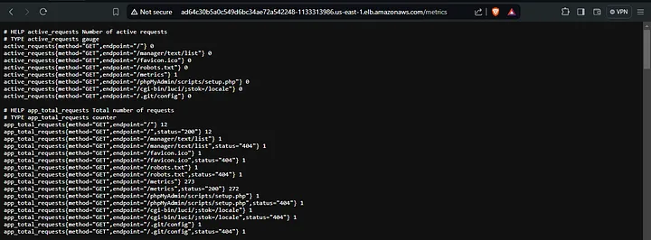

# Configure Alert Manager with Slack Notifications on Kubernetes Cluster — Helm Kube-Prometheus Stack

Medium article link: https://medium.com/@phil16terpasetheo/configure-alert-manager-with-slack-notifications-on-kubernetes-cluster-helm-kube-prometheus-stack-112878c35f26

This repository explains demonstrates to configure and deploy alert manger on a Kubernetes cluster, deploy a demo Golang application that scrapes metrics and finally, run a demo of the alerting rules by receiving message a slack message from alert manager when we manually take down the running Golang app.


# Pre-requisites

- A running Kubernetes Cluster (If you don’t have one, a terraform script is provided to provision one for you on AWS EKS)
- If you’ll use the terraform script, you’ll need an AWS account configured (Access Keys)
- AWS CLI configured
- Helm Installed
- Git installed

## Spin Up Cluster

If you don't have a running cluster, you can easily spin up one with the terraform configuration provided in this repository. Once you've cloned the repo, navigate to `/terraform` folder and execute the commands below. It will set up VPC, EKS and EC2 instances as AWS nodes.

```
terraform init
terraform validate
terraform apply --auto-approve
```

Download the kube config to your local machine using the command below:

```
aws eks --region us-east-1 update-kubeconfig --name demo-cluster
```

It takes a while to complete, around 20mins.

## Install Kube-Prometheus Stack

Use the commands below to install kube-prometheus stack to the kubernetes cluster

```
helm upgrade --install -f kube-prometheus.yaml kube-prometheus prometheus-community/kube-prometheus-stack -n monitoring
```
The command uses `kube-prometheus.yaml` values file to install the kube prometheus stack on the cluster. Confirm that all prometheus stakc pods are running successfully

```
kubectl get pods -n monitoring
```


You can use port forward to access prometheus UI using the command below:

```
kubectl port-forward svc/kube-prometheus-kube-prome-prometheus -n monitoring 9090
```

With this command, you can access prometheus on your local computer using `localhost:9090`


## Install Golang Application

To spin up the golang application, use the command below to create a deployment from the manifest provided in the repository

```
kubectl apply -f app.yml
```

Confirm that the golang app is running.

```
kubectl get pods
kubectl get svc
```


If you’re using the EKS cluster provided, you can access the app through the load balancer link/endpoint provided in the svc. Notice in the screenshot below, the app fetched metrics and return them on /metrics route.




## Set Up Prometheus And Alertmanager Config

### Podmonitor
The repository uses custom CRDs provided by Kube-prometheus stack to set up alert manager rules and to scrape metrics from the pods to prometheus. 

It uses pod monitor to get metrics from the pod into prometheus. To set up the pod monitor, execute the command to create it using the config file in the repo.

```
kubectl apply -f podmonitor.yml
```

confirm that pod monitor is fetching metrics by quering metrics `app_total_metrics`


### Prometheus Rule

We then proceed to set up rules in prometheus that checks if the number of pods is less than 2 running for 1m, it should send firing alerts to alert manager.

```
kubectl apply -f prometheus-rule.yml
```

### Set Up Slack Integration

To get slack to work with alert manager, we will need to add a webhook URL. See the medium article for guide on how to set up one. Edit `kube-prometheus.yml` file to add your webhook URL

```
alertmanager:
  config:
    global:
      slack_api_url: <API URL here>
```

### Alertmanager Routes and Recievers

Routes in alert manager work by pointing alerts from sources using labels to recievers. Recievers are simply configurations to either slack, email, chat bot or http requests.

In this repo, we point label app:app-1 to slack-notification reciever. Apply the configuration using the command below:

```
kubectl apply -f alert-config.yml
```

## Test Alerts

To test the alerting rule, remember we set alerts if pods are below 2 for 1min. So if we scale down the golang app to 1 the alerting rule should be triggered

```
kubectl scale deployments.apps app-1 --replicas=1
```


If you scale back up, it should return a resolved state


## Clean Ups

First remove all manifests and kube-prometheus CRD resources applied using the command below

```
kubectl delete -f .\alert-config.yml
kubectl delete -f .\podmonitor.yml
kubectl delete -f .\prometheus-rule.yml
```

Remove the kube prometheus stack using helm

```
helm uninstall kube-prometheus -n monitorin
```

Remove the Golang application deployment manifest

```
kubectl delete -f .\app.yml
```

Finally, remove the EKS cluster using terraform in `/terraform` folder

```
terraform destroy --auto-approve
```

