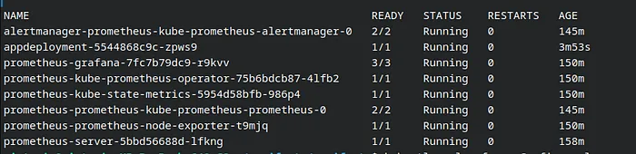
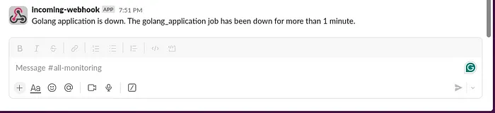

# Configure Alert Manager with Slack Notifications on Kubernetes Cluster

Article URL: https://medium.com/@phil16terpasetheo/configure-alert-manager-with-slack-notifications-on-kubernetes-cluster-711387dbcaad

This repository is a demonstration of how to install alert manager using the kubernetes manifest files provided for alertmanager. We also proceed to monitor a simple golang application and set rules that send slack notification to a specified channel if the golang application is down.

## Requirements

To set up this repository, you'll need the following

- Running Kubernetes Cluster
- Kubectl installed

If you don't have a running k8s cluster, the repository includes a terraform configuraiton that sets up VPC, EKS and EC2 nodes on AWS. You will need the following to set it up

- Terraform installed
- AWS credentials configured on your machine
- AWS CLI installed

## Spin Up Cluster

If you don't have a running cluster, you can easily spin up one with the terraform configuration provided in this repository. Once you've cloned the repo, navigate to `/terraform` folder and execute the commands below. It will set up VPC, EKS and EC2 instances as AWS nodes.

```
terraform init
terraform validate
terraform apply --auto-approve
```

It takes a while to complete, around 20mins

Also download the cluster's kube config using the command below:

```
aws eks --region us-east-1 update-kubeconfig --name my-cluster
```

## Set Up golang application
To install the golang application, first create a namespace where we will install prometheus, alertmanager, and the golang application. Use the command below to create the namespace

```
kubectl create namespace prometheus
```

To install the golang app, create a file `application.yml` and paste the content below:

```
apiVersion: apps/v1
kind: Deployment
metadata:
  name: appdeployment
spec:
  replicas: 1
  selector:
    matchLabels:
      app: my-app
  template:
    metadata:
      labels:
        app: my-app
    spec:
      containers:
        - name: my-app-container
          image: Philcz16/goapp
          imagePullPolicy: Always
          ports:
          - containerPort: 8080
         
---
apiVersion: v1
kind: Service
metadata:
  name: appservice
spec:
  selector:
    app: my-app
  ports:
    - protocol: TCP
      port: 80
      targetPort: 8080
  type: NodePort
```

apply the application on the kubernetes cluster using the command below:

```
kubectl apply -f application.yml
```

## Install Alert Manager & Prometheus

Configure alert manger. In `configmaps.yml` , replace your slack API URL in the manifest file. You can easily set up a slack URL https://amanranjanverma.medium.com/how-to-create-a-webhook-url-for-a-slack-channel-b5b58b1d208a.

This will set up all configurations for alert manager and prometheus. Including prometheus targets and alert manager rules.
```
kubectl apply -n prometheus -f configmaps.yml
```

This will set up role bindings for prometheus to access the cluster and scrape metrics
```
kubectl apply -n prometheus -f authorization.yml
```

This will install prometheus and alert manager on the cluster.
```
kubectl apply -n prometheus -f deployment.yml
```

Confirm that all pods are running successfully:

```
kubectl get pods -n prometheus
```



## Alert Manager in Action

To test alert manager in action, scale down the golang application to 0 pods to trigger the rule we set.

```
kubectl scale deployment appdeployment --replicas=0 -n prometheus
```

You should recieve a slack message in `#Alerts` Channel



# Clean Ups

To clean up everything and delete the running cluster, execute the command below:

```
terraform destroy --auto-approve
```