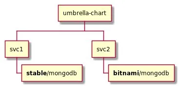
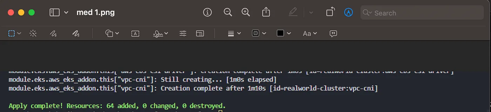
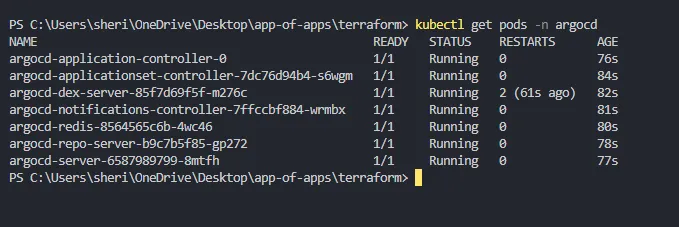
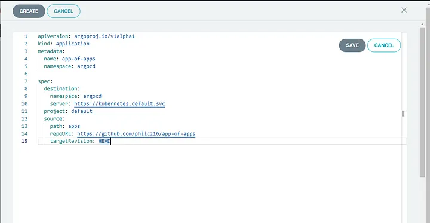
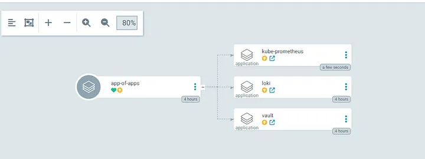
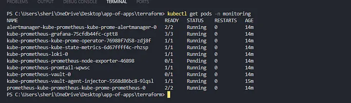

# Install Kube-Prometheus-Stack, Loki, and Vault on Kubernetes using App of Apps Pattern and Helm Umbrella Charts with ArgoCD

Article link: https://blog.devops.dev/install-kube-prometheus-stack-loki-and-vault-on-kubernetes-using-app-of-apps-pattern-and-helm-959d02f21959

This repository demonstrates how ArgoCD can be used to install multiple helm charts using the umbrella chart startegy. This strategy is mostly useful when you need to install helm charts you do not manage example, Loki to your kubernetes cluster using argocd and you need to customize it by editing the default values file. 

In this repository, we set up a kubernetes cluster on EKS, install ArgoCD on it and proceed to install Kube-Prometheus stack, Loki and Vault using same umbrella charts in ArgoCD. The imag below gives and overview of the umbrella chart concept.



## Requirements
To set up this repo, you'll need the following installed on your computer

- Kubectl Installed
- Running Kubernetes Cluster 

If you don't have a running k8s cluster, the repository includes a terraform configuraiton that sets up VPC, EKS and EC2 nodes on AWS. You will need the following to set it up

- Terraform installed
- AWS credentials configured on your machine
- AWS CLI installed

## Spin Up Cluster

If you don't have a running cluster, you can easily spin up one with the terraform configuration provided in this repository. Once you've cloned the repo, navigate to `/terraform` folder and execute the commands below. It will set up VPC, EKS and EC2 instances as AWS nodes.

```
terraform init
terraform validate
terraform apply --auto-approve
```

It takes a while to complete, around 20mins



## Install ArgoCD 

If you used the terraform configuration to spin up the cluster, use the command below to download and set up kube config to your machine.

```
aws eks update-kubeconfig --region us-east-1 --name realworld-cluster
```

Once the context is updated, Install ArgoCD with kubectl using the command below:

```
kubectl create namespace argocd
```

Install ArgoCD on the cluster using the command below;

```
kubectl create namespace argocd
```

```
kubectl apply -n argocd -f https://raw.githubusercontent.com/argoproj/argo-cd/stable/manifests/install.yaml
```

Confirm if argocd is running successfully

```
kubectl get pods -n argocd
```



You can access ArgoCD's dashboard UI using the command below:

```
kubectl port-forward svc/argocd-server -n argocd 8080:443
```

The port forward opens a session on your running terminal which will let you reach the service on your computer's localhost. On your browser, navigate to `localhost:8080` and argocd should be running there. To get argocd's password, use the command below:

```
kubectl -n argocd get secret argocd-initial-admin-secret -o jsonpath="{.data.password}"
```

The password is returned in base64 so you can use a base64 converter to decode a good one is in this site https://www.base64decode.org/

## Create ArgoCD Apps

To install all applications in argocd, we make use of the argocd App of Apps pattern to install all argoCD apps. Proceed to create the root app. In the argocd UI, click create a new app and paste the content of `app-of-apps.yml` Click save and click Create



ArgoCD should pick up all three applications in the github repo



You can then proceed to sync all apps. 




## Clean Ups

To clean up everything created and delete all resources, execute the command below in `/terraform` directory.

```
terraform destroy --auto-approve
```
