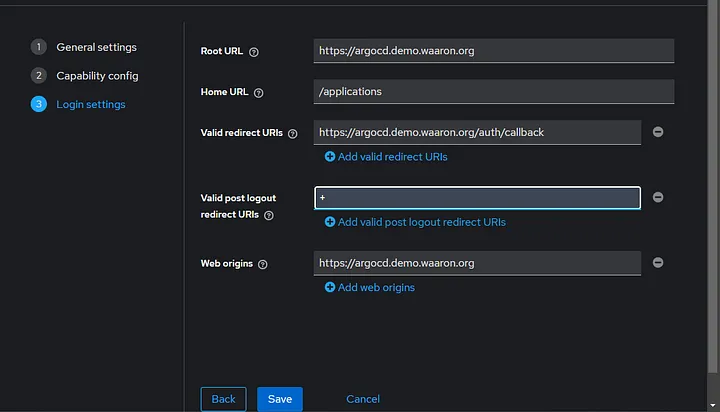
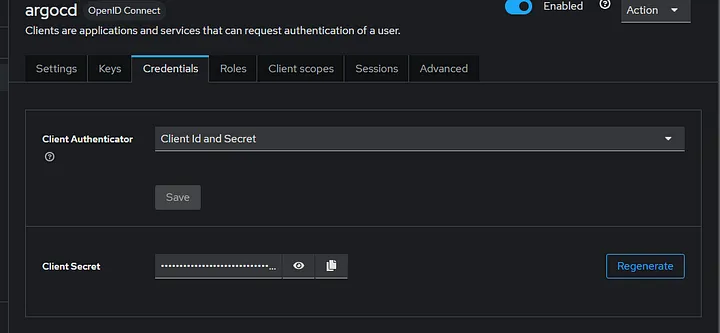

# Configure SSO authentication to ArgoCD and Harbor with Keycloak on EKS Cluster

Medium article link: https://blog.devops.dev/configure-sso-authentication-to-argocd-and-harbor-with-keycloak-on-eks-cluster-1791b1aa27b0

This repository, demonstrates how you can bootstrap a kubernetes cluster with ArgoCD, Install Harbor, and Keycloak and finally, use Keycloak as SSO provider to ensure passwordless login on ArgoCD and Harbor using Keycloak. To set up this environment on kubernetes, you'll need the following:

## Requirements

- A running Kubernetes Cluster
- Existing Domain name
- Terraform Installed
- kubectl installed
- Helm Installed

If you don't have a running k8s Cluster, a terraform configuration is provided that will spin up VPC resources and EKS cluster on your AWS account. 

## Spin Up Cluster

If you don't have a running cluster, you can easily spin up one with the terraform configuration provided in this repository. Once you've cloned the repo, navigate to `/kubernetes-cluster` folder and execute the commands below. It will set up VPC, EKS and EC2 instances as AWS nodes.

```
terraform init
terraform validate
terraform apply --auto-approve
```

Download the kube config to your local machine using the command below:

```
aws eks --region us-east-1 update-kubeconfig --name demo-cluster
```

It takes a while to complete, around 20mins.

## Install Nginx Ingress

This demo uses nginx ingress to seamlessly access each service ArgoCD, Keycloak and Harbor using host based routing. I have a sub domain of demo.waaron.org so to implement host based routing for all three services, we will use the hosts:

argocd.demo.waaron.org — → ArgoCD Service

keycloak.demo.waaron.org — -> Keycloak Service

harbor.demo.waaron.org — -> Harbor Service.

To install nginx ingress, using the command below we apply a kubernetes manifest. The command installs ingress nginx using the manifest file in the repo folder.

```
kubectl apply -f ingress-nginx.yml
```

Confirm if all nginx resources are created successfully.

```
kubectl get all -n ingress-nginx
```


### Map CNAME record

Once Nginx controller is fully set up and you have an external IP provided to you, head over to your domain provider and map and “A” record pointing to that external IP. In my case I have a loadbalancer dns name, I’ll use a CNAME record for all three endpoints. Notice that i used the same load balancer endpoint for all domains.


## Install Certificate Manager

Since we will be creating public domains, it will be wise to create generate TLS certificates inside the kubernetes cluster with a certificate provider. This will allow us to accept HTTPS connections through all endpoints.

To install cert manager, first add the helm repository using the command below:

```
helm repo add jetstack https://charts.jetstack.io --force-update
```

Install the helm chart using the command below:

```
helm install cert-manager jetstack/cert-manager --namespace cert-manager --create-namespace --version v1.15.2 --set crds.enabled=true
```


Confirm that cert manager resources are running

```
kubectl get all -n cert-manager
```


## Provision a Cluster Issuer
To set up certificates we will need an issuer which will sign the certificate. This issuer is typically a provider like letsencrypt that will approve that the domain is valid.

In the repo folder, navigate to `/cert-manager` and apply the manifest `issuer.yml`

```
kubectl apply -f ./cert-manager/issuer.yml
```

## Create Namespaces 
Let's proceed to create namespaces for argocd, keycloak and Harbor to ensure all apps are isolated and deployed neatly.

```
kubectl apply -f ./cert-manager/namespace.yml
```

## Generate TLS Certificates

Let's proceed to generate TLS certificates for all three domains `harbor.demo.waaron.org`, `argocd.demo.waaron.org`, `keycloak.demo.waaron.org`. Ensure you edit these domain names in `certificate.yml` file.

```
kubectl apply -f certificate.yml
```

Wait for a while for it to enter a ready state and Confirm that all certificates are created and issued.

```
kubectl get certificates -n keycloak
kubectl get certificates -n argocd
kubectl get certificates -n harbor
```


## Install ArgoCD

Let’s proceed to install ArgoCD and configure it to use the domain and TLS certificate we created.

```
helm repo add argo https://argoproj.github.io/argo-helm
```

In the repository folder, there’s a file called argocd-values.yml it's the values file for argocd that specifies the nginx ingress class name, the domain name to use and also the TLS certificate to use.

```
helm upgrade --install argo-cd argo/argo-cd --version 7.3.10 --reuse-values -f .\argocd-values.yml --namespace argocd --create-namespace
```

Confirm that argocd is running successfully 

```
kubectl get pods -n argocd
```


You can also check the ingress created by the argocd helm chart

```
kubectl get ingress -n argocd
```


You can see the host mapped correctly and the address pointing to the load balancer’s DNS name. On your browser, open the host for argocd and you should get a secured connection:


Now we have ArgoCD installed, let’s proceed to install Keycloak.

## Install Keycloak

We will still use helm to install Keycloak. First add the helm repo using the command below. We will be using Keycloack from bitnami helm chart:

```
helm repo add bitnami https://charts.bitnami.com/bitnami
```

the values file is `keycloak-values.yml` ensure you edit the hostname and tls certificate to match your domain name.
```
helm upgrade --install keycloak bitnami/keycloak  --reuse-values -f .\keycloak-values.yml --namespace keycloak --create-namespace
```

Confirm that all keycloak resources are running.

```
kubectl get pods -n keycloak
```


Access keycloak UI using the domain you set


## Install Harbor

Let’s proceed to finally install harbor using helm. First add harbor helm chart using the command below

```
helm repo add harbor https://helm.goharbor.io
```

```
helm upgrade --install harbor harbor/harbor --namespace harbor --create-namespace --reuse-values -f ./harbor-values.yml
```

Confirm that harbor resources are provisioned successfully

```
kubectl get pods -n harbor
```


Access harbor UI using the domain you set for it.


## Configure SSO login with Keyclock on ArgoCD

Congrats on reaching this far. Now we will set up the SSO login to Argocd using keycloak. Login to the Keycloak UI from the domain host you set earlier mine is `keycloak.demo.waaron.org`

Sign in using the admin as username and admin12345 as password. You should have a UI like the screen shot below:


Click on Clients and create a new client. Note that we are using the defaul “master” realm. To create a client, click on Clients > Create Client.

Name enter “argocd” as client ID and “ArgoCD Client” as client name click next. Ensure that you selected OpenID connect in the client type.


Turn on client authentication and ensure you check mark Standard flow and Direct Access grants. Click next


Enter the domain URL you set for ArgoCD and the home URL to be /applications. Enter your argocd domain and append /auth/callback behind it for rediect URIs.

Also enter + for valid post logout URIs. And your argocd domain as web origin. Click on Save.



After clicking save, there should be a credentials tab on that page copy the client secret and save somewhere. We will use it in argocd.



Assuming the user is authenticated to argocd, we will need to specify a groups claim for that user to assume. To do this, we will need to create a client scope.

On the left tab click on Client Scopes and click on Create scope. Name the scope groups. Also ensure that you enable “Include in token scope” and click on Save.


Now we need to add a mapper that will point the groups claim to the token when the user requests the group scope. Click on the tab mappers and click on “Configure a new mapper” select Group Membership. Set the name and the token claim name to groups. Also disable full group path. Click Save


Now head back to the Client we created earlier in the clients tab with name “argocd”, click on client scopes click on “add a client scope”. Select the scope we created called groups. Add it as defualt.


Finally, on the left tab, click on groups and ArgoCDAdmins.


Click on the members tab and add a member. Add the admin user as a member of the group.


### Enable SSO on ArgoCD

Now we can head over to argocd running our kubernetes cluster and enable SSO login with keycloak. Before you proceed, encrypt the client secret you copied as base64 a good tool to use can be: https://www.base64encode.org/

Edit argocd secret and add the keycloak secret using the keyname oidc.keycloak.clientSecret

```
kubectl edit secret argocd-secret -n argocd
```

The secret should look like this (Ensure you use the base64 value):

```
apiVersion: v1
kind: Secret
metadata:
  name: argocd-secret
data:
  ...
  oidc.keycloak.clientSecret: ODMwODM5NTgtOGVjNi00N2IwLWE0MTEtYThjNTUzODFmYmQy   
  ...
```

Edit argocd configmap using the command below:

```
kubectl edit configmap argocd-cm -n argocd
```

Edit the config map and add the oidc config data key. Also confirm that the url and issuer are the domain hosts you’ve set in previous steps.

```
apiVersion: v1
kind: ConfigMap
metadata:
  name: argocd-cm
data:
  url: https://argocd.demo.waaron.org
  oidc.config: |
    name: Keycloak
    issuer: https://keycloak.demo.waaron.com/realms/master
    clientID: argocd
    clientSecret: $oidc.keycloak.clientSecret
    requestedScopes: ["openid", "profile", "email", "groups"]
```

Finally, let’s attach the groups e created earlier in keycloak. Edit the config map using the command below:

```
kubectl edit configmap argocd-rbac-cm -n argocd
```

Add the data given below with key policy.csv

```
apiVersion: v1
kind: ConfigMap
metadata:
  name: argocd-rbac-cm
data:
  policy.csv: |
    g, ArgoCDAdmins, role:admin
```

Now check the ArgoCD UI, refresh and confirm if the SSO login button is up. You can see login via Keycloak.


If you click on it, it will redirect you to keycloak to login then back to the applications page


If Argocd refuses to authenticate you, in a scenario where it displays the applications page then forcefully take you back to login again, simply refresh argocd pods using the command below

```
kubectl rollout restart deployment argo-cd-argocd-server -n argocd
```

## Configure SSO login with Keyclock on Harbor

OIDC setup on Herbor is more easier. All we have to do is set up the client on keycloak and enter it’s details and secret using the Harbor admin dashboard.

Navigate back to your keycloak dashboard on the domain and create a new client. Set the client ID as harbor


Enable client authentication


Set root URL and home URL as the host name you created for harbor. In my case harbor.demo.waaron.org. Also set redirect URI to https://harbor.demo.waaron.org/c/oidc/callback Click on save.


Navigate to the secret tab and copy the secret value Somewhere.

### Enable SSO in harbor

Now head over to your harbor host name on your browser in my case, harbor.demo.waaron.org and login as admin. username: admin password: Harbor12345

On Harbor UI, on the left pane click on Administration > Configuration > Authentication Select OIDC

For name enter Keycloak. Also Enter https://keycloak.demo.waaron.org/realms/master as OIDC endpoint (Ensure you edit the host to yours). Also fill in the client id as harbor and secret what you copied earlier. For client scope, enter openid,profile,roles and click save.


Test the connection and save.


On Harbors login page, you should see login with Keycloak


# Clean Up

## Uninstall Harbor
To uninstall harbor, execute the command below:

```
helm uninstall harbor -n harbor
```

## Uninstall ArgoCD
Uninstall argocd using the command below

```
helm uninstall argo-cd --namespace argocd
```

## Uninstall Keycloak

To clean up keycloak uninstall the helm chart with the command below

```
helm uninstall keycloak --namespace keycloak
```

## Uninstall Nginx Ingress
To remove nginx ingress, ensure you’re in the project repo folder and execute the command below:

```
kubectl delete -f .\ingress-nginx.yaml
```
You can also proceed to delete all certificates also.

## Delete Cluster
Finally delete the cluster:

```
cd kubernetes-cluster
terraform destroy --auto-approve
```

