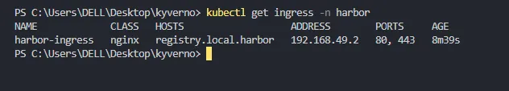

# Install Kyveno on Kubernetes and Enforce Policy to only Allow Repo from Harbor

Medium Article: https://medium.com/@phil16terpasetheo/install-kyverno-and-harbor-on-kubernetes-and-enforce-only-images-from-harbor-using-policies-8c45545d1532

This repository demonstrates how to set up kyverno policy management on your kubernetes clusters and enforce policies to only allow image pull strictly only from Harbor container registry. 


## Requirements

To spin up this repository, you'll need the following requirements:
- Helm Installed
- Kubectl Installed
- A running k8s cluster
- Minikube Installed

## Spin up a minikube cluster

If you have minikube installed, spin up a cluster with it using the command below:

```
minikube start
```

Enable nginx ingress with it

```
minikube addons enable ingress
```

Confirm that the ingress is running successfully

```
kubectl get pods -n ingress-nginx
```


## Install Harbor

Harbor is a self hosted container registry that provides features such as image scanning, private secrets, etc..

Add harbor's helm chart using the command below:

```
helm repo add harbor https://helm.goharbor.io
```

Install harbor using the `harbor` folder provided in the repository

```
helm install harbor ./harbor -n harbor --create-namespace
```

Confirm that all harbor resources ar created successfully


Harbor creates it's own ingress url under the nginc ingress class

```
kubectl get ingress -n harbor
```



So we can access the Harbor registry using the endpoint https://registry.local.harbor but before we do that, we need to modify the host machine’s hostname to be able to resolve the domain name on our local computer.

If you’re using a windows machine, navigate to the directory C:\Windows\System32\drivers\etc and edit the hosts file in Administrator mode. Add the line below in the file.

```
127.0.0.1  registry.local.harbor
```

If you’re using a UNIX/MAC machine, open the hosts file in the directory /etc/hosts and add the line below

```
127.0.0.1  registry.local.harbor
```

Finally, open a seperate terminal from the one you’ve been using and execute the command below:

```
minukube tunnel
```

This will open a session for us to access all services and ingress defined in the minikube cluster. You can then access the registry Interface in your browser usign the URL https://registry.local.harbor


Login using the default credentials below. Note that you can modify this in the values file.

```
Username: admin
Password: Harbor12345
```

Don’t hesitate to create a new project using the UI. Create a project and name it k8s. We’re going to push an nginx image to this project.


Push an image to Local Harbor Registry
On your local machine, execute the command to login to the registry use the same credentials you used to login to the web interface to login to the registry.

```
docker login https://registry.local.harbor
```

## Push nginx image to Harbor


Next, we will pull an nginx image and tag it with our harbor image url and then push the image to harbor local registry running in kubernetes.

```
docker pull nginx:alpine
```

Tag the image with our harbor registry URL

```
docker tag nginx:alpine registry.local.harbor/k8s/nginx:alpine
```

Finally, push the image to the harbor registry.

```
docker push  registry.local.harbor/k8s/nginx:alpine
```


## Install Kyverno

We will use helm to install Kyverno on the Minikube Kubernetes cluster. Add kyverno helm repo using the command below:

```
helm repo add kyverno-repo https://kyverno.github.io/kyverno/
```

Install the helm chart using the command below

```
helm install kyverno kyverno-repo/kyverno -n kyverno-ns --create-namespace
```

Also confirm that all of kyverno’s resources are created successfully.


## Enforce Kyverno Policy

The policy in `disallow_any_repo.yml` creates an enforced rule that doesn't allow installation of any repository not from `registry.local.harbor`. It proceed to specify that the policy should only be on `app-namespace` namespace.

```
kubectl apply -f .\disallow_any_repo.yaml
```


To test the policy, let’s first of all create the app-namespace

`kubectl create ns app-namespace`

## Test Policy Rule

Edit `nginx.yml` if contains a deployment of an nginx deployment using harbor's registry, change the image name to `nginx:alpine`

```
kubectl apply -f nginx.yaml -n app-namespace
```

It should be rejected with an error message


But if you edit the image back to `registry.local.harbor/k8s/nginx:alpine`, you should be allowed to apply the config.

# Conclusion
Writing policies to ensure that compliance and best practices are followed in your kubernetes environment is key to advanced security. This can aid your cluster security. Kyverno is a great tool and can be used to write out more complex policies to meet your cluster security needs.